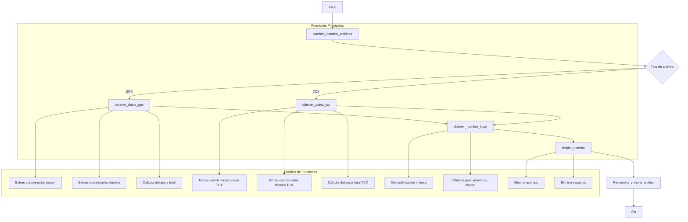

# AdvanceTrack

Una herramienta Python para procesar y renombrar archivos GPX y TCX basándose en la información de ubicación.

## Requisitos Previos

- Python 3.8 o superior
- pip (gestor de paquetes de Python)
- Paquetes requeridos:
  - gpxpy
  - geopy
  - unidecode
  - argparse

## Configuración Previa

1. Clonar el repositorio:
```bash
git clone https://github.com/yourusername/AdvanceTrack.git
```

2. Instalar dependencias:
```bash
pip install -r requirements.txt
```

## Características

- Procesamiento de archivos GPX y TCX
- Extracción de coordenadas de origen y destino
- Geocodificación inversa para obtener nombres de ubicaciones
- Cálculo de distancias totales
- Renombrado automático de archivos basado en ubicaciones
- Respaldo automático de archivos originales

## Estructura

```
AdvanceTrack/
│
├── main.py          # Script principal
├── README.md        # Documentación
└── requirements.txt # Dependencias
```

## Diagrama de Flujo



### Descripción de las Funciones

1. `cambiar_nombre_archivos(ruta_directorio)`
   - Entrada: Ruta del directorio a procesar
   - Procesa recursivamente archivos GPX y TCX
   - Crea directorio de resultados con timestamp

2. `obtener_datos_gpx(archivo_gpx)`
   - Entrada: Archivo GPX
   - Retorna: origen, destino, distancia_total
   - Extrae metadata y coordenadas

3. `obtener_datos_tcx(archivo_tcx)`
   - Entrada: Archivo TCX
   - Retorna: origen, destino, distancia_total
   - Extrae metadata y coordenadas

4. `obtener_nombre_lugar(coordenadas)`
   - Entrada: Tuple de coordenadas (lat, lon)
   - Retorna: Diccionario con país, provincia, ciudad
   - Realiza geocodificación inversa

5. `limpiar_nombre(nombre)`
   - Entrada: String con nombre del lugar
   - Retorna: String normalizado sin acentos ni espacios

## Uso

### Local

1. Navegar al directorio del proyecto:
```bash
cd AdvanceTrack
```

2. Ejecutar el script:
```bash
python main.py <ruta_directorio>
```

### Ejemplos

```bash
# Procesar un directorio específico
python main.py /ruta/a/mis/archivos/gpx

# Procesar el directorio actual
python main.py .
```

## Notas

- Los archivos originales se mantienen en su ubicación original
- Se crea una nueva carpeta con fecha y hora para los resultados
- El proceso puede tardar dependiendo del número de archivos

## Logging

El programa registra su actividad en la consola, mostrando:
- Archivos procesados
- Errores encontrados
- Resultados del renombrado


